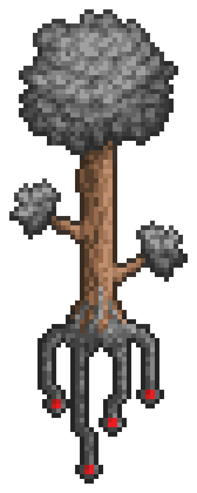
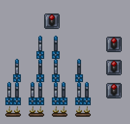
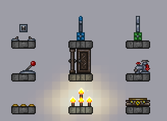

<h1 align="center">
  <picture></picture>
   
  WireHead
</h1>
<h2 align="center">
  A drastically faster reimplementation of Terraria wiring
</h2>

  

# Summary

A Terraria mod that significantly increases the capabilities of complex wiring projects. Chiefly it does the following: 
1. Reimplements Terraria's wiring system in a much, much more efficient way that allows much faster circuits while maintaining pure vanilla logic
2. Provides an commands to interface with the game through the command line, mainly by writing binary files into large swathes of logic lamps

WireHead was developed for the [Computerraria](https://github.com/misprit7/computerraria/tree/main) project so all the features are directly useful there, although it has been developed with general use cases in mind and any large scale wiring projects should be able to easily integrate it with little to no modifications. 

# Accelerator Theory

Terraria's vanilla wiring system is extremely naive. Even without any computer science knowledge it's possible to improve it, and with some additional thought it's possible to gain many orders of magnitude of performance. 

The target audience of this explanation is a computer science university student with at least a moderate amount of experience with Terraria wiring, so if you don't know what big O notation is or you've never heard of a faulty logic lamp it probably won't make a ton of sense. Before reading I would highly encourage you to get a decompiled version of the Terraria source code. This can be pretty easily Googled, or ideally follow [this guide](https://github.com/tModLoader/tModLoader/wiki/tModLoader-guide-for-contributors) to decompile it for yourself with proper intellisense. 

## Optimization 1: Group Caching

### Justification

  

Example 1: A simple mechanism with a long wire

When a source is triggered (e.g. a switch is clicked), vanilla Terraria conducts a breadth first search along the entire wire, hitting each output along the way. For example, in the image above when the switch is clicked, the game would start on the leftmost wire tile, check in each direction (up/down/right/left), realize there's a wire to the right and continue in that direction. This would repeat until no more wires can be reached. 

This is clearly extremely suboptimal if high performance is desired. Every time the switch is clicked it takes $O(n)$ time to toggle the candle on the right, where $n$ is the length of the wire, despite only one bit being transmitted. The solution to this is to precompute all the wire connections and all mechanisms attached to each. I define a __group__ to be a set of connected blocks with wires of a certain color, and each group receives a unique identifying integer. To make this more clear, consider the following scenario: 

### Groups

  

Example 2: Showcasing how groups are formed

It's a bit hard to tell from the picture but there is a diagonal (// shaped) junction box at the intersection of the red wires. Here, there are 4 groups pictured. The up/left red wires form one group, let's assign it id 0, and the down/right red wires form another with id 1. They are separate groups, since although they share a common tile they are not connected due to the junction box. The green wire on the bottom forms another group, assign it id 2. The yellow wire on top is a group and give it id 3, despite it not being connected to any outputs. Note the ids assigned here are arbitrary, as long as they uniquely define a group. 

### Implementation

To find these groups, for each color, we start with a 2 dimensional array of ``int``s the size of the world initialized to negative one, signaling no group. We can then loop over each tile of the world, and if the tile has a wire on it and isn't already part of a group we can do a recursive depth first search along all connected tiles, marking each tile with the current group along the way. Once we've looped over the entire world 4 times (once for each color) this way we've found all the wiring groups, and have a fast way of looking up which group if any a tile belongs to. 

In addition to the group associated with each tile, we also need the set of outputs connected to each group. As we're constructing the groups as described above, we check the current tile during the search. If it is a tile that is affected by a wire, we add it to a set of output tiles associated with the current group id. For example, the groups above are being constructed, the set of output tiles associated with group id 0 (left red) would be the tile of the leftmost lamp, id 1 (right red) would be associated with the middle lamp and id 2 (green) would be associated with both the leftmost and rightmost lamp. Id 3 (yellow) wouldn't have any corresponding output tiles since there are none connected to it. Although I'm describing this process in terms of sets here, note that in my implementation everything is implemented as arrays for higher performance (see the micro optimization section). 

Once we've done all this precompilation, triggering a wire goes from $O(n)$ to $O(1)$. If for example the top switch gets triggered in the example, all we have to do is look up the wire groups corresponding to each square of the switch, fetch the output tiles corresponding to these wire groups and trigger them. No traversal is done at run time, which for most practical circuits reduces the time complexity of the resultant circuits tremendously. 

## Optimization 2: Toggle Lazy Evaluation

### Motivation

I was slightly misleading in the previous section. I claimed that using group caching the time complexity was reduced from $O(n)$ to $O(1)$. To see where this can still sometimes fail, consider the following circuit: 

  

Example 3: Demonstration of when the number of outputs is large

Even if we precompute which tiles to trigger every time the switch is pressed, we still have to go through each gate individually and trigger its inner lamp, call the number of outputs on a group $m$. Thus the actual time complexity of the above method is $O(n+m)$, and group caching just reduces this to $O(m)$. Even though $m$ is smaller than $n$ (since each wire tile is connected to at most 1 output), in the worst case $O(m)$ is equivalent to $O(n)$. 

You might wonder, does this matter? The example circuit I gave seems to be rather contrived, and most circuits in for example an ALU have very few outputs per group. Unfortunately however, there's one extremely universal circuit component that requires it: memory. Even if you're extremely clever about how you go about designing it, you will inevitably have to traverse the width of memory at least once on each random access (I'd be interested in anyone has a satisfying proof of this, but regardless I'm fairly certain it's true). The approach taken in [Computerraria](https://github.com/misprit7/computerraria) is that of a binary tree, so a very simplified version of this will be used here for example. 

  
  

Example 4: A simple binary tree structure that models ram

In example 4, the mechanism is setup such that when the top switch is pressed, a signal cascades downward going either right or left depending on whether or not the selection levers on the right have been pressed or not. Once the signal reaches the bottom, the selected torch will toggle. This is analogous to the write functionality of RAM. It's not relevant here, but you can take me on my word that it's easy to extend this to reading as well with just one additional layer and some additional latching circuitry. If you're not intimately familiar with faulty logic gates and the details of the functionality are unclear to you, don't worry about it. The important part is the yellow wire on the bottom, which traverses the *width* of the binary tree. While this doesn't seem too bad computationally in this tiny example, the width of a binary tree grows with $O(n)$ while the height grows with $O(\log n)$. In the context of [Computerraria](https://github.com/misprit7/computerraria), there are 96kb of ram, so the width is approximately 200,000 tiles while the height is less than 20. Thus this issue is of real importance, since looping through all 200,000 tiles is an unacceptable performance bottleneck. 

### Types of Tiles

To solve this issue, we can make an important observation. Of all the types of wiring related blocks in Terraria, you can separate them into three main types:

- Triggers: Tiles that send a pulse through a wire, e.g. switches, levers
- Toggleable: Tiles that toggle between two possible state on a wire pulse with no other side effects, e.g. torches, candles, doors
- Triggerable: Tiles that react to a wire pulse but not in a simple two state way, e.g. pumps, teleporters

  

Example 5: Examples of the different categories - left is triggers, middle is toggleable, right is triggerable

Logic gate lamps (non-faulty ones) are a special case, and an extraordinarily important one at that. When attached to a regular logic gate, they are triggerable, as although they have two states to go between, whenever they change states they have the side effect of needing to recalculate the gate that is under them. However when they are part of a faulty logic gate, they are toggleable, as only when the faulty gate above them gets triggered does the gate potentially release a signal. 

### Lazy Evaluation

Once you make this observation, an important optimization arises. If a wire is connected solely to triggers and toggleable tiles, then we can hold the entire state of the wire in one bit without losing any information about the tiles connected to the group. 

To see what I mean, consider example 4 again, and imagine that the yellow wire is being triggered very often compared to the red wire at the top. Instead of updating the state of each logic lamp of the bottom layer every time the yellow wire is triggered, start the yellow wire in an "off" state, and every time it's pressed we could toggle it's state to "on" or "off" without updating any of the tiles connected to it. Then, when the red wire finally is pressed and we need to evaluate one of the faulty logic gates on the bottom layer, we could determine what its current state is by comparing it to the state of the yellow wire. If the yellow wire was triggered an even number of times its state will be "off" and the current in-game state of the logic lamp is correct, and if the yellow wire was triggered an odd number of times its state will be "on" and the in-game state of the bottom lamps are inverted. Writing this out as a truth table: 

| Lamp State | Group State | Current State |
|------------|-------------|---------------|
| 0          | 0           | 0             |
| 0          | 1           | 1             |
| 1          | 0           | 1             |
| 1          | 1           | 0             |

This is just the truth table for XOR. In general, if a toggleable tile is connected to an arbitrary number of groups fulfilling the no-triggerable tile requirement (although in Terraria it's limited to 4 since there are 4 wire colors), then the "real" current state of that tile is the current tile XORed with the current group state of each group connected to it. When we're evaluating a faulty gate over such a lamp we can compute this value on the fly quickly, so there's no need to keep the lamp updated to its true value in the world until the user manually wants to sync. 

### Other Considerations

Upon seeing this you might instinctively feel like this is "cheating"; the in-game, visual representation of the toggleable tiles is no longer being preserved. The important point here though is that all information is 100% being conserved. At any point, you can loop through the entire world, and for each tile update it to what it "should" be based on the current group states, then reset all the group states back to "off." In WireHead this is implemented through the ``/accel sync`` command. In my view this preserves the vanilla logic system, as the actual functionality and internal state is being maintained. 

Of course this approach does have its limitations. The group state only works on groups that only contain toggleable tiles, since triggerable must always be evaluated immediately. Since regular logic gates are all triggerable, it means that the only feasible way to make RAM in this way is with faulty logic gates. However, if as a circuit maker you jump through these hoops and keep these considerations in mind the benefit is huge. Instead of traversing the width of a hypothetical binary tree we've reduced the problem to toggling a single bit, which is obviously much faster. Time complexity wise this approach reduces a wire press (for a group with only toggleable tiles) from $O(m+n)$ to $O(1)$, for real this time. 

## Micro-Optimizations

To be continued
<!-- Even once you implement the changes described above to vanilla code, -->

